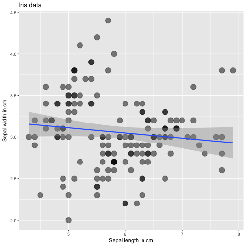
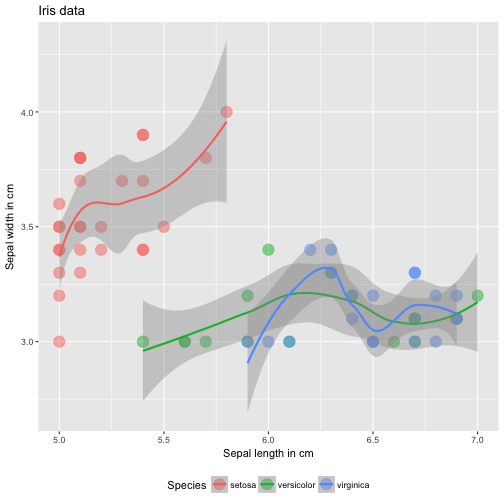

Reproducible Pitch Presentation
========================================================
author:Charilaos
date:08/06/2018
autosize: true

Introduction
========================================================
This presentation is part of the Course Project for the Coursera "Developing Data Products" course

The first part was to create a Shiny application and deploy it on Rstudio's server. This is the second part, which entails to prepare a reproducible pitch presentation about the developped application.

The application itself is available at:

The application
========================================================

This app helps you to see the relationship between the sepal length and the sepal width of all the flowers in the iris dataset.

- First, you need to enter the minimum and maximum values for the sepal length and the sepal width with the sliders on the left of the screen. You can see that these limits are then projected on the scatterplot at the right
- If the "Show Species" checkbox is selected then the flowers are classified and colored by their species (setosa, versicolor, virginica).
- Finally, you can use the dropdown menu to select if you want a model to fit the data in the scatterplot. There are two available options: a linear fit and a local polynomial regression fit to capture the nonlinear trends.

Example 1
========================================================
In this example, all the observations of the dataset are included, they are not differentiated by their species and the overall fit is presented with a linear model

Example 2
========================================================
In this example, we have included only a subset of the data using the sliders on the left, the "show species" checkbox was selected, and hence there is a model fit for each of the three species. Here the polynomial fit was selected instead of the linear.

